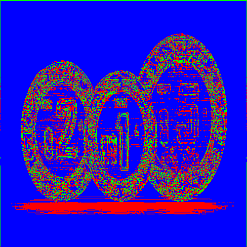

# Knn Classifier and Edge Recognition-Based Segmentation Using K-means

## Overview

This project, **Knn Classifier and Edge Recognition-Based Segmentation Using K-means**, is an implementation in **C++** focused on applying machine learning techniques to image classification. Specifically, the project aims to classify images of washers and coins—two objects with similar circular shapes—by combining several key algorithms:

- **K-nearest neighbors (Knn) classifier**
- **K-means clustering** for image segmentation
- **Sobel filters** for edge detection
- **Hu moments** for shape analysis
- **BMP format**: The algorithm uses **BMP** format for input and output images

## Key Features

- **Knn classifier**: For image-based object classification
- **K-means segmentation**: For partitioning images based on features
- **Sobel edge detection**: For identifying edges in the images
- **Hu moments**: For analyzing shapes and improving classification
- **C++**: Implemented entirely from scratch in C++

## Images

Here are some segmented sample images in the project:

Processed samples:

                       

## Dataset

Please note that the dataset used in this project is **not included** in the repository because it is too large to be hosted here. 
